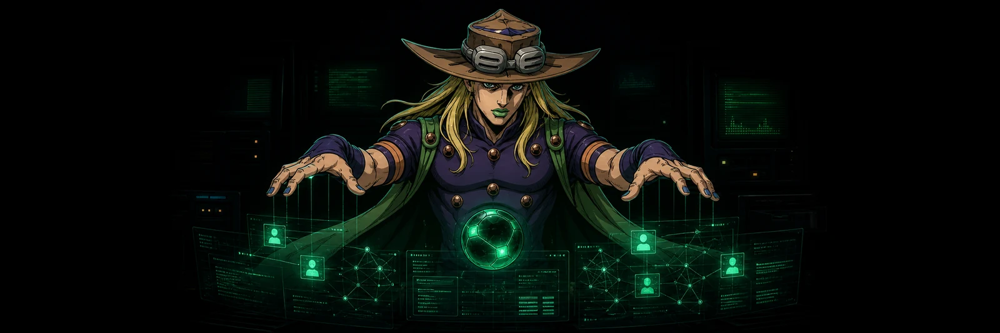

<p align="center">
  
</p>

<h1 align="center">SHAKH // AI SPECIALIST &amp; DEVELOPER</h1>

<p align="center">
  <code>building intelligent systems, AI products, and experimental software</code>
</p>

<p align="center">
  
</p>

<p align="center">
  
  
  
  
</p>

<!-- FIGlet 2.2.5 / ANSI Shadow. FIGlet is distributed under the New BSD license: https://www.figlet.org/ -->

```text
 ▄▄▄▄▄▄▄▄▄▄ ▄▄▄▄▄ ▄▄▄▄▄ ▄▄▄▄▄▄▄▄▄▄   ▄▄▄▄▄▄▄▄▄ 
█▄█████████ █████ █████ █████████▄█ █▄███████▄█
█▓▓▓█▀█▓▓▓█ █▓▓▓█ █▓▓▓█ █▓▓▓▓▓▓▓▓▓█ █▓▓▓▓▓▓▓▓▓█
█▒▒▒█▄█████ █▒▒▒█ █▒▒▒█ █▄▄▄█▀█▒▒▒█ █▒▒▒█▀█▒▒▒█
█░░░█░░░░░█ █░░░█▄█░░░█ █░░░█▄█░░░█ █░░░█ █░░░█
█░░░█▀█░░░█ █▀▀▀▀▀▀░░░█ █░░░▀▀▀░░▄█ █░░░█ █░░░█
█▒▒▒█▄█▒▒▒█ █▒▒▒█▄█▒▒▒█ █▒▒▒█ █▒▒▒█ █▒▒▒█▄█▒▒▒█
█▓▓▓▓▓▓▓▓▓█ █▓▓▓▓▓▓▓▓▓█ █▓▓▓█ █▓▓▓█ █▓▓▓▓▓▓▓▓▓█
███████████ ███████████ █████ █████ ███████████
▀▀▀▀▀▀▀▀▀▀▀ ▀▀▀▀▀▀▀▀▀▀▀ ▀▀▀▀▀ ▀▀▀▀▀ ▀▀▀▀▀▀▀▀▀▀▀```

## `> whoami`

I turn model capability into actual products: agents that use tools, interfaces that expose what they are doing, and full-stack systems that survive outside a demo.

I do not stop at prompts. I build the layer between the model and the user — orchestration, permissions, state, failure paths, product UX, and deployment.

```text
[ EXPERIENCE ]  3 years building with AI
[ DEEP FOCUS ]  6+ months in agent runtimes, model orchestration and AI product engineering
[ OUTPUT     ]  34 repositories across public and private work
[ MODE       ]  learn fast // build hard // ship what works
```

## `> systems --selected`

### `01 // VERSUS LLM` &nbsp; 

Two LLM agents debate a question in the terminal. A judge model reads the exchange and returns a concise verdict. Published as an installable Python CLI.

<p>
  <a href="https://github.com/gyrroxx/versus-llm"></a>
  <a href="https://github.com/gyrroxx/versus-llm/stargazers"></a>
</p>

`PYTHON` `OPENROUTER` `MULTI-AGENT DEBATE` `TERMINAL UX`

---

### `02 // GYROLAB` &nbsp; 

A local browser-first coding agent with streaming tool calls, workspace editing, diff review, rollback, PTY, model controls, and guarded execution through OpenRouter.

`TYPESCRIPT` `AI AGENTS` `TOOL USE` `MONACO` `XTERM.JS` `PLAYWRIGHT`

---

### `03 // DRIP CARDS` &nbsp; 

A Telegram collectible product spanning an aiogram bot, Next.js Mini App, PostgreSQL economy, live operations tooling, and real-prize mechanics.

`NEXT.JS` `PYTHON` `TELEGRAM MINI APP` `POSTGRESQL` `PRISMA` `DOCKER`

## `> arsenal --verified`

<p align="center">
  
  
  
  
  
  
  
  
  
  
</p>

```text
AI SYSTEMS      agents / tool use / context / permissions / evaluation
PRODUCT         UX / architecture / failure states / iteration / shipping
FULL STACK      interfaces / APIs / data / infrastructure / operations
```

## `> github --signal`

<p align="center">
  
</p>

<p align="center">
  
  
</p>

<p align="center"><sub>Most active systems are private. Public statistics show only part of the work.</sub></p>

## `> contact --open-channel`

If you are building something ambitious around AI, agents, developer tools, or product engineering — send a signal.

<p align="center">
  <a href="https://t.me/dokaqq"></a>
</p>

---

<p align="center">
  <code>GYRO STATUS: ONLINE // CHANNEL SECURE // READY FOR THE NEXT SYSTEM</code>
</p>

<p align="center"><sub>Build signal. Cut noise.</sub></p>
